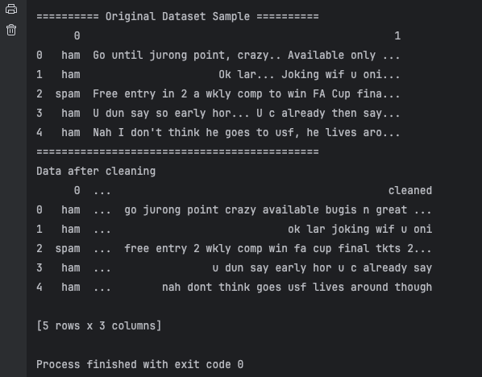
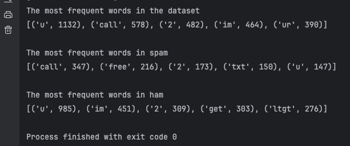
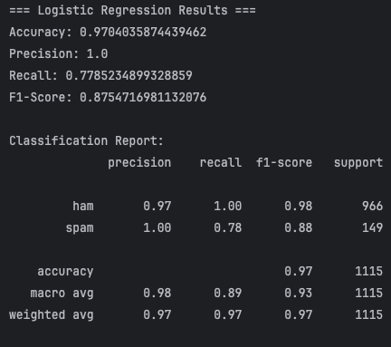
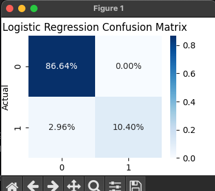
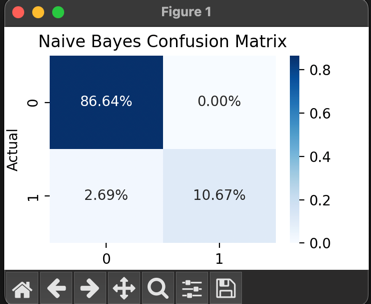
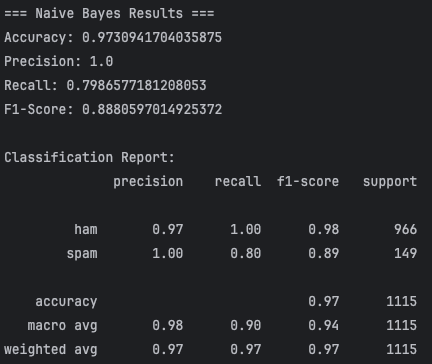

# -Text-classification-project

 ### Overview 
This project implements a text classification system to detect spam messages using machine learning. It demonstrates end-to-end ML pipeline from data preprocessing to model deployment with a web interface.

  ### Dataset                                                                                                                               
 **Source**: [SMS Spam Collection Dataset](https://archive.ics.uci.edu/ml/datasets/sms+spam+collection)                                 
 - **Categories**: 2 (Ham: legitimate messages, Spam: spam messages)
 - **Location**: `dataset/sms+spam+collection/SMSSpamCollection` 
 - **Size**: 5574 SMS messages

 ### Data preprocessing
 - **Text cleaning**: lower case,punctuation removal
 - **Stopwords**: preserve spam indicators
 - **Dataset**: Dataset saved as cleaned CSV for reuse<br>
  Below is an example of data before and after cleaning:


  ### Exploratory Analysis
- Word frequency statistics for entire dataset
- Separate analysis for spam vs ham messages
- Most common words visualization <br>
Below is an example of the most common words in spam and ham messages and in the whole dataset:


### Model Training
- **Algorithms**: Logistic Regression and Naive Bayes <br
- **Vectorization**: TF-IDF with max 3000 features
- **Split**: 80/20 train/test with stratification
- **Evaluation**: Accuracy, Precision, Recall, F1-Score
- **Visualization**: Confusion matrix <br>
- **Algorithm that performs better**: Naive Bayes<br><br>
**Logistic Regression**:<br>
<br>
<br><br>
**Naive Bayes**:<br>
- <br>
- 

 ### Prediction Interface
 - Command-line prediction script
 - Web application with Flask
 - JSON API endpoint for integration
 - Real-time probability scoring

### Installation

 1. Clone the repository: https://github.com/ErzaQorrii/-Text-classification-project.git
```bash
         git clone https://github.com/ErzaQorrii/-Text-classification-project.git
         cd text-classification-project
```     
 2. Create and activate a virtual environment (optional but recommended):
```bash
         python -m venv venv
         source venv/bin/activate  # On Windows use `venv\Scripts\activate`
```
 3. Install required packages:
```bash
         pip install -r requirements.txt
```
 4. Download NLTK data:
  ```bash
           python nltk_setup.py
   ```
### Usage
1. **Activate virtual environment:**
source venv/bin/activate<br>
1. **Preprocess data:**
  ```bash
     cd src
     python preprocess.py
  ```
  2.**Run exploratory analysis:**<br>
  ```bash
     cd src
    python exploratoryAnalysis.py  
```
  3. **Train models**:
```bash
   python train_models.py
```
  4. **Make predictions**(CLI):
  ```bash
     python predict.py
  ```

  5. **Run web app**:
  ```bash
     python app.py
   ```
  5. **Visit http://localhost:5000**:
